---
## Front matter
title: "Отчёт по лабораторной работе №1"
subtitle: "Дисциплина: Архитектура компьютеров и операционные системы"
author: "Дауд Амжад"

## Generic otions
lang: US-RU
toc-title: "Содержание"

## Bibliography
bibliography: bib/cite.bib
csl: pandoc/csl/gost-r-7-0-5-2008-numeric.csl

## Pdf output format
toc: true # Table of contents
toc-depth: 2
lof: true # List of figures
fontsize: 12pt
linestretch: 1.5
papersize: a4
documentclass: scrreprt
## I18n polyglossia
polyglossia-lang:
  name: russian
  options:
  - spelling=modern
  - babelshorthands=true
polyglossia-otherlangs:
  name: english
## I18n babel
babel-lang: russian
babel-otherlangs: english
## Fonts
mainfont: PT Serif
romanfont: PT Serif
sansfont: PT Sans
monofont: PT Mono
mainfontoptions: Ligatures=TeX
romanfontoptions: Ligatures=TeX
sansfontoptions: Ligatures=TeX,Scale=MatchLowercase
monofontoptions: Scale=MatchLowercase,Scale=0.9
## Biblatex
biblatex: true
biblio-style: "gost-numeric"
biblatexoptions:
  - parentracker=true
  - backend=biber
  - hyperref=auto
  - language=auto
  - autolang=other*
  - citestyle=gost-numeric
## Pandoc-crossref LaTeX customization
figureTitle: "Рис."
listingTitle: "Листинг"
lofTitle: "Список иллюстраций"
lolTitle: "Листинги"
## Misc options
indent: true
header-includes:
  - \usepackage{indentfirst}
  - \usepackage{float} # keep figures where there are in the text
  - \floatplacement{figure}{H} # keep figures where there are in the text
---

# Цель работы

Целью данной работы является приобретение практических навыков установки операционной системы на виртуальную машину, настройки минимально необходимых для дальнейшей работы сервисов.

# Задание

1. Создание виртуальной машины
2. Установка операционной системы
3. Установка драйверов для VirtualBox
4. Настройка раскладки клавиатуры
5. Установка имени пользователя и названия хоста
6. Установка программного обеспечения для создания документации

# Выполнение лабораторной работы

## Создание виртуальной машины

Запускаю VirtualBox:

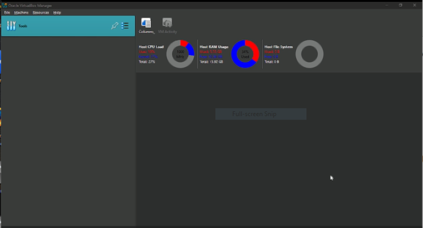{#fig:001 width=70%}

Нажимаю кнопку new, задаю имя машины и добавляю новый привод оптических дисков и выбираю образ: 

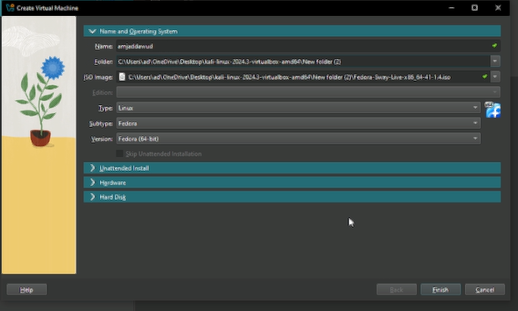{#fig:002 width=70%}

Указиваю размер основной памяти виртуальной машины - 2048 МБ и задаю 2 процессора:

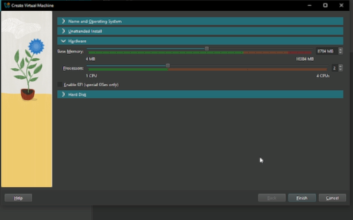{#fig:003 width=70%}

Задаю размер диска — 100 ГБ:

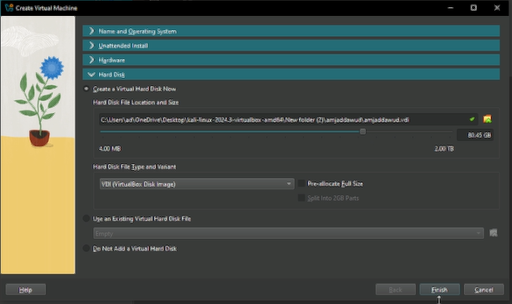{#fig:004 width=70%}

Задаю машину видеопамять 128МБ и запускаю её:

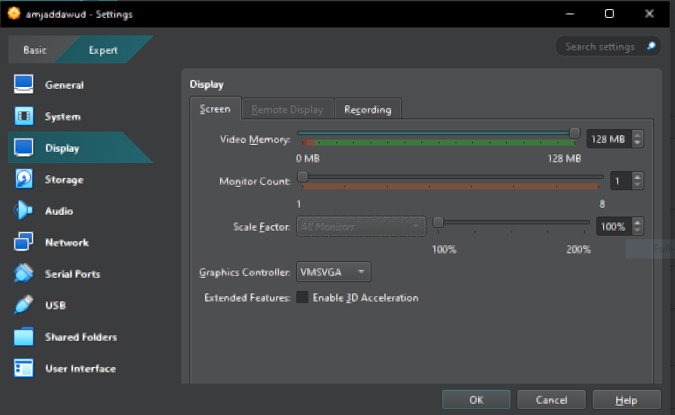{#fig:005 width=70%}

## Установка операционной системы

Появился интерфейс начальной конфигурации. Нажимаю Enter для создания конфигурации по умолчанию и, чтобы выбрать в качестве модификатора клавишу Win. Нажимаю комбинацию Win+Enter для запуска терминала. В терминале запускаю liveinst:

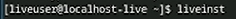{#fig:006 width=70%}

Выбераю язык интерфейса и перехожу к настройкам установки операционной системы:

{#fig:007 width=70%}

Место установки ОС оставляю без изменения:

{#fig:008 width=70%}

Установляю имя и пароль пользователя:

{#fig:009 width=70%}

## Установка драйверов для VirtualBox

После завершения установки операционной системы перезапускаю виртуальную машину. Далее вхожу в ОС под заданной мной при установке учётной записью. Нажимаю комбинацию Win+Enter для запуска терминала. Переключаюсь на роль супер-пользователя и обновляю все пакеты:

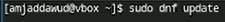{#fig:0010 width=70%}

Установливаю программы для удобства работы в консоли:

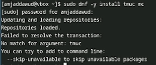{#fig:0011 width=70%}

Установливаю программного обеспечения для автоматического обновления:

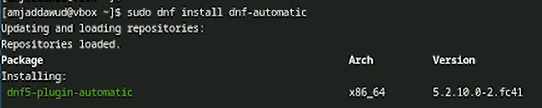{#fig:0012 width=70%}

Запускаю таймер:

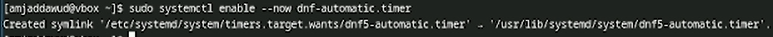{#fig:0013 width=70%}

Я не буду рассматривать работу с системой безопасности SELinux, поэтому отключим его. В файле /etc/selinux/config заменяю значение SELINUX=enforcing на значение SELINUX=permissive. Перегрузаю виртуальную машину:

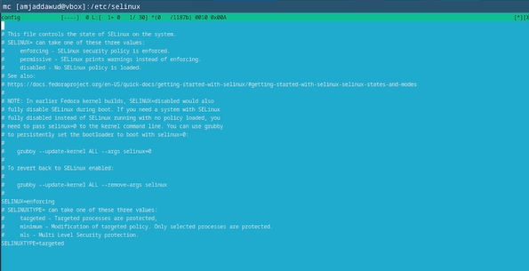{#fig:0014 width=70%}

Вхожу в ОС под заданной мной при установке учётной записью. Нажимаю комбинацию Win+Enter для запуска терминала. Запускаю терминальный мультиплексор tmux, переключаюсь на роль супер-пользователя используя sudo -i и установляю средства разработки:

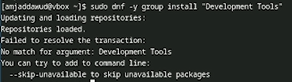{#fig:0015 width=70%}

Установливаю пакет DKMS используя dnf -y install dkms. В меню виртуальной машины подключаю образ диска дополнений гостевой ОС. Подмонтирую диск mount /dev/sr0 /media

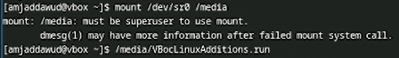{#fig:0016 width=70%}

Далее установливаю драйвера указав /media/VBoxLinuxAdditions.run и перегружаю виртуальную машину.

## Настройка раскладки клавиатуры

Вхожу в ОС под заданной мной при установке учётной записью. Нажимаю комбинацию Win+Enter для запуска терминала. Запускаю терминальный мультиплексор tmux. Создаю конфигурационный файл. Переключаюсь на роль супер-пользователя с помощью sudo -i и отредактирую конфигурационный файл /etc/X11/xorg.conf.d/00-keyboard.conf. После этого перегружаю машину:

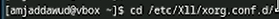{#fig:0017 width=70%}

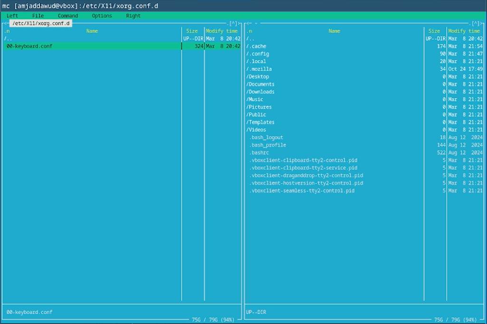{#fig:0031 width=70%}

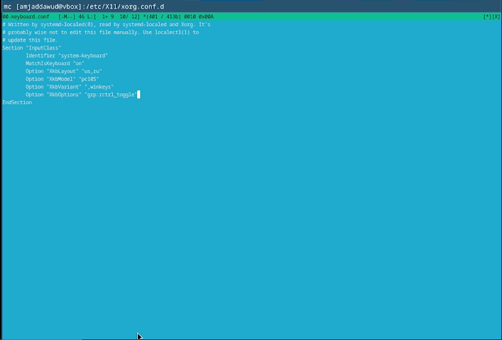{#fig:0032 width=70%}

## Установка имени пользователя и названия хоста

Запукаю виртуальную машину и залогинуюсь. Нажимаю комбинацию Win+Enter для запуска терминала. Запускаю терминальный мультиплексор tmux. Переключаюсь на роль супер-пользователя. Создаю пользователя (вместо username указиваю мой логин в дисплейном классе) и задаю пароль для пользователя:

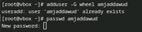{#fig:0018 width=70%}

Проверяю, что имя хоста установлено верно:

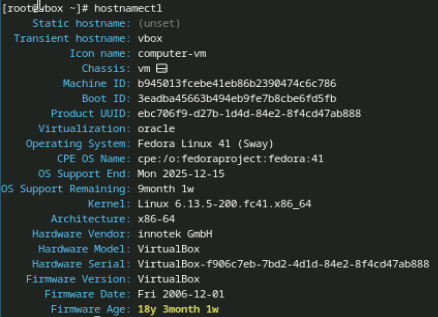{#fig:0019 width=70%}

## Установка программного обеспечения для создания документации

Нажимаю комбинацию Win+Enter для запуска терминала. Запускаю терминальный мультиплексор tmux и переключаюсь на роль супер-пользователя:

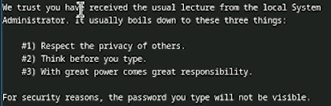{#fig:0020 width=70%}

Установливаю pandoc с помощью менеджера пакетов:

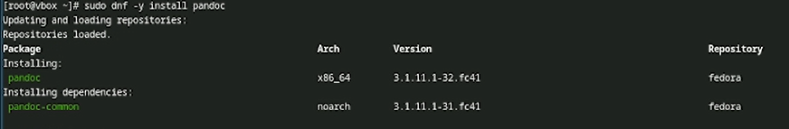{#fig:0021 width=70%}

Установливаю TexLive с помощью менеджера пакетов:

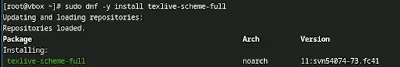{#fig:0022 width=70%}

# Выводы

При выполнении проделанной работы я приобретела практические навыки установки операционной системы на виртуальную машину, настройки минимально необходимых для дальнейшей работы сервисов.

# Дополнительное задание

В окне терминала проанализирую последовательность загрузки системы, выполнив команду dmesg:

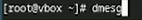{#fig:0023 width=70%}

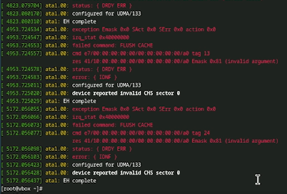{#fig:0024 width=70%}

С помощью grep (dmesg | grep -i "то, что ищем"), получаю:
- Версию ядра Linux (Linux version).

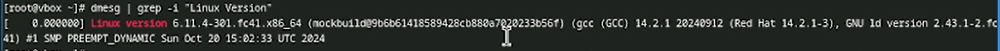{#fig:0025 width=70%}

- Частота процессора (Detected Mhz processor):

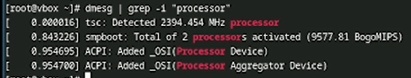{#fig:0026 width=70%}

- Модель процессора (CPU0):

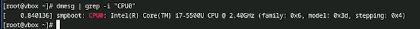{#fig:0027 width=70%}

- Объём доступной оперативной памяти (Memory available):

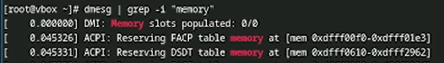{#fig:0028 width=70%}

- Тип обнаруженного гипервизора (Hypervisor detected):

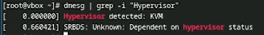{#fig:0029 width=70%}

- Последовательность монтирования файловых систем:

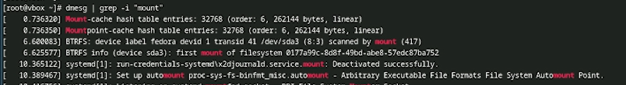{#fig:0030 width=70%}

# Контрольные вопросы (ответы)

1. Учетная запись содержит необходимые для идентификации пользователя при подключении к системе данные, а так же информацию для авторизации и учета: системного имени (user name) (оно может содержать только латинские буквы и знак нижнее подчеркивание, еще оно должно быть уникальным), идентификатор пользователя (UID) (уникальный идентификатор пользователя в системе, целое положительное число), идентификатор группы (CID) (группа, к к-рой относится пользователь. Она, как минимум, одна, по умолчанию - одна), полное имя (full name) (Могут быть ФИО), домашний каталог (home directory) (каталог, в к-рый попадает пользователь после входа в систему и в к-ром хранятся его данные), начальная оболочка (login shell) (командная оболочка, к-рая запускается при входе в систему).

2. Для получения справки по команде: --help,
   для перемещения по файловой системе - cd, 
   для просмотра содержимого каталога - ls,
   для определения объёма каталога - du <имя каталога>,
   для создания / удаления каталогов - mkdir/rmdir, 
   для создания / удаления файлов - touch/rm,
   для задания определённых прав на файл / каталог - chmod,
   для просмотра истории команд - history

3. Файловая система - это порядок, определяющий способ организации и хранения и именования данных на различных носителях информации. 
   Примеры: FAT32 представляет собой пространство, разделенное на три части: олна область для служебных структур, форма указателей в виде таблиц и зона для хранения самих файлов. ext3/ext4 - журналируемая файловая система, используемая в основном в ОС с ядром Linux.

4. С помощью df в терминале. Это утилита, которая показывает список всех файловых систем по именам устройств, сообщает их размер и данные о памяти. Также посмотреть подмонтированные файловые системы можно с помощью утилиты mount.

5. Чтобы удалить зависший процесс, вначале мы должны узнать, какой у него id: используем команду ps. Далее в терминале вводим команду kill < id процесса >. Или можно использовать утилиту killall, что "убьет" все процессы, которые есть в данный момент, для этого не нужно знать id процесса.

# Список литературы{.unnumbered}

1. [Архитектура ЭВМ](https://esystem.rudn.ru/mod/page/view.php?id=1098787#org370d403)

2. Dash, P. Getting Started with Oracle VM VirtualBox / P. Dash. – Packt Publishing Ltd, 2013. – 86 сс.

2. Colvin, H. VirtualBox: An Ultimate Guide Book on Virtualization with VirtualBox. VirtualBox / H. Colvin. – CreateSpace Independent Publishing Platform, 2015. – 70 сс.

3. Vugt, S. van. Red Hat RHCSA/RHCE 7 cert guide : Red Hat Enterprise Linux 7 (EX200 and EX300) : Certification Guide. Red Hat RHCSA/RHCE 7 cert guide / S. van Vugt. – Pearson IT Certification, 2016. – 1008 сс.

4. Робачевский, А. Операционная система UNIX / А. Робачевский, С. Немнюгин, О. Стесик. – 2-е изд. – Санкт-Петербург : БХВ-Петербург, 2010. – 656 сс.

5. Немет, Э. Unix и Linux: руководство системного администратора. Unix и Linux / Э. Немет, Г. Снайдер, Т.Р. Хейн, Б. Уэйли. – 4-е изд. – Вильямс, 2014. – 1312 сс.

6. Колисниченко, Д.Н. Самоучитель системного администратора Linux : Системный администратор / Д.Н. Колисниченко. – Санкт-Петербург : БХВ-Петербург, 2011. – 544 сс.

7. Robbins, A. Bash Pocket Reference / A. Robbins. – O’Reilly Media, 2016. – 156 сс.

