---
## Front matter
lang: ru-RU
title: Презентация по лабораторной работе №2
subtitle: Архитектура компьютеров и Операционные Системы
author:
  - Дауд А.
institute:
  - Российский университет дружбы народов, Москва, Россия
date: 9 Марта 2025

## i18n babel
babel-lang: russian
babel-otherlangs: english

## Formatting pdf
toc: false
toc-title: Содержание
slide_level: 2
aspectratio: 169
section-titles: true
theme: metropolis
header-includes:
 - \metroset{progressbar=frametitle,sectionpage=progressbar,numbering=fraction}
 - '\makeatletter'
 - '\beamer@ignorenonframefalse'
 - '\makeatother'
---

# Цель работы

Изучение идеалогии, применение средств контроля версий и освоение умения по работе с git.

# Задание

- Создать базовую конфигурацию для работы с git.
- Создать ключ SSH.
- Создать ключ PGP.
- Настроить подписи git.
- Зарегистрироваться на Github.
- Создать локальный каталог для выполнения заданий по предмету.

## Создание базовой конфигурации для работы с git.

  Установление git и gh:

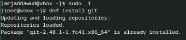{#fig:001 width=70%}

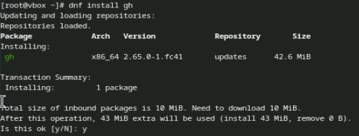{#fig:002 width=70%}

## Создание базовой конфигурации для работы с git.

 В качестве имя и email владельца репозитории задаю свои имя и email и настраиваю utf-8:

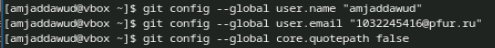{#fig:003 width=70%}

## Создание базовой конфигурации для работы с git.

Задаю имя начальной ветки и паррамеры autocrlf и safecrlf:

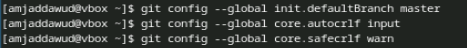{#fig:004 width=70%}

## Создание ключ ssh

Создаю ключи ssh по алгоритму rsa с размером 4096 бит:

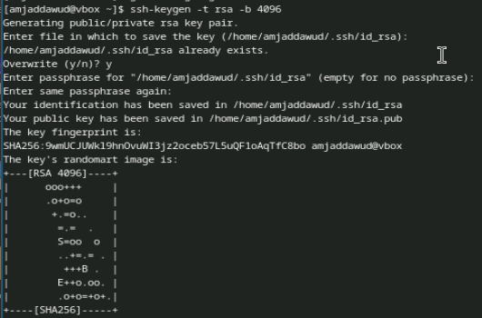{#fig:005 width=70%}

## Создание ключ gpg

Генерирую ключ gpg --full-generate-key:

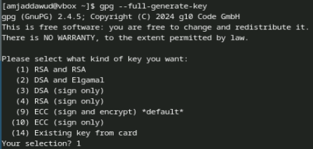{#fig:006 width=70%}

## Создание ключ gpg

Из предложенных опций выбираю тип RSA and RSA; размер 4096; срок действия 0: 

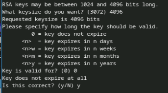{#fig:007 width=70%}

## Создание ключ gpg

GPG запросил личную информацию, которая сохранится в ключе Имя и адрес электронной почты:

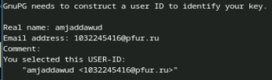{#fig:008 width=70%}

## Создание ключ gpg

Вывожу список ключей:

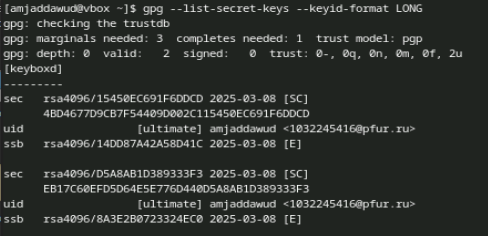{#fig:0010 width=70%}

## Создание ключ gpg

Установливаю xclip: 

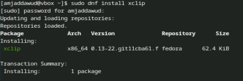{#fig:0011 width=70%}

## Создание ключ gpg

Cкопирую сгенерированный gpg ключ в буфер обмена:

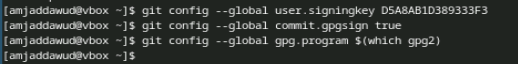{#fig:0012 width=70%}

## Создание ключ gpg

Далее перехожу в настройки GitHub, нажимаю на кнопку New GPG key и вставляю полученный ключ:

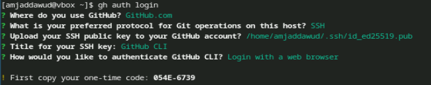{#fig:0013 width=70%}

## Создание ключ gpg

Используя введёный email, указиваю Git применять его при подписи коммитов:

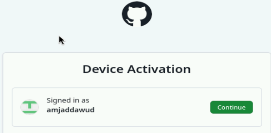{#fig:0014 width=70%}

## Создание ключ gpg

Начинаю авторизацию в gh используя gh auth login:

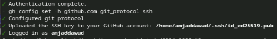{#fig:0015 width=70%}

## Создание ключ gpg

Завершаю авторизацию на броузер:

{#fig:0016 width=70%}

## Создание локального каталога для выполнения заданий.

Создаю каталог "mkdir -p ~/work/study/2022-2023/"Операционные системы":

{#fig:0018 width=70%}

## Создание локального каталога для выполнения заданий.

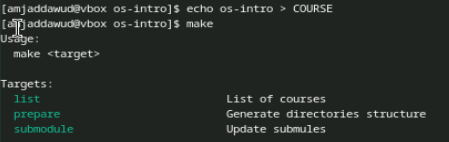{#fig:0019 width=70%}

## Создание локального каталога для выполнения заданий.

Удаляю лишные файлы:

{#fig:0020 width=70%}

## Создание локального каталога для выполнения заданий.

Создаю еще необходимые каталоги:

{#fig:0021 width=70%}

## Создание локального каталога для выполнения заданий.

Отправляю Файлы на сервер:

{#fig:0022 width=70%}

# Выводы

При выполнении лабораторной работы я изучила идеалогию, применение средств контроля версий и освоеила умение по работе с git.
