---
## Front matter
title: "Отчёт по лабораторной работе №2"
subtitle: "Дисциплина: Архитектура Компьютеров и Операционные Системы"
author: "Дауд Амжад"

## Generic otions
lang: ru-RU
toc-title: "Содержание"

## Bibliography
bibliography: bib/cite.bib
csl: pandoc/csl/gost-r-7-0-5-2008-numeric.csl

## Pdf output format
toc: true # Table of contents
toc-depth: 2
lof: true # List of figures
fontsize: 12pt
linestretch: 1.5
papersize: a4
documentclass: scrreprt
## I18n polyglossia
polyglossia-lang:
  name: russian
  options:
  - spelling=modern
  - babelshorthands=true
polyglossia-otherlangs:
  name: english
## I18n babel
babel-lang: russian
babel-otherlangs: english
## Fonts
mainfont: PT Serif
romanfont: PT Serif
sansfont: PT Sans
monofont: PT Mono
mainfontoptions: Ligatures=TeX
romanfontoptions: Ligatures=TeX
sansfontoptions: Ligatures=TeX,Scale=MatchLowercase
monofontoptions: Scale=MatchLowercase,Scale=0.9
## Biblatex
biblatex: true
biblio-style: "gost-numeric"
biblatexoptions:
  - parentracker=true
  - backend=biber
  - hyperref=auto
  - language=auto
  - autolang=other*
  - citestyle=gost-numeric
## Pandoc-crossref LaTeX customization
figureTitle: "Рис."
listingTitle: "Листинг"
lofTitle: "Список иллюстраций"
lolTitle: "Листинги"
## Misc options
indent: true
header-includes:
  - \usepackage{indentfirst}
  - \usepackage{float} # keep figures where there are in the text
  - \floatplacement{figure}{H} # keep figures where there are in the text
---

# Цель работы

Изучение идеалогии, применение средств контроля версий и освоение умения по работе с git.

# Задание

1. Создать базовую конфигурацию для работы с git.
2. Создать ключ SSH.
3. Создать ключ PGP.
4. Настроить подписи git.
5. Зарегистрироваться на Github.
6. Создать локальный каталог для выполнения заданий по предмету.

# Выполнение лабораторной работы

## Создание базовой конфигурации для работы с git.

Установливаю git используя "dnf install git":

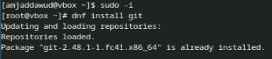{#fig:001 width=70%}

С помощью dnf install gh, установливаю gh:

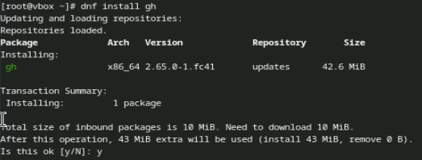{#fig:002 width=70%}

В качестве имя и email владельца репозитории задаю свои имя и email и настраиваю utf-8:

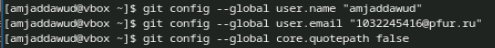{#fig:003 width=70%}

Задаю имя начальной ветки и паррамеры autocrlf и safecrlf:

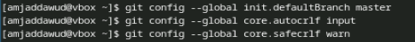{#fig:004 width=70%}

## Создание ключ ssh

Создаю ключи ssh по алгоритму rsa с размером 4096 бит:

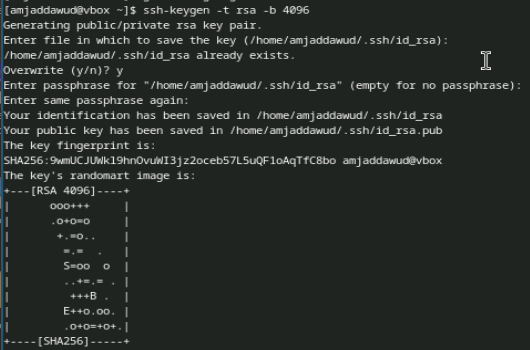{#fig:005 width=70%}

## Создание ключ gpg

Генерирую ключ gpg --full-generate-key:

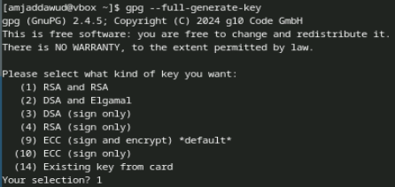{#fig:006 width=70%}

Из предложенных опций выбираю тип RSA and RSA; размер 4096; срок действия 0: 

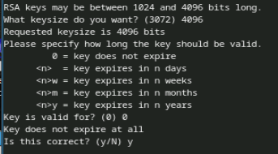{#fig:007 width=70%}

GPG запросил личную информацию, которая сохранится в ключе Имя и адрес электронной почты:

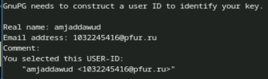{#fig:008 width=70%}

У меня уже есть аккаунт на github, поэтому я вхожу в систему:

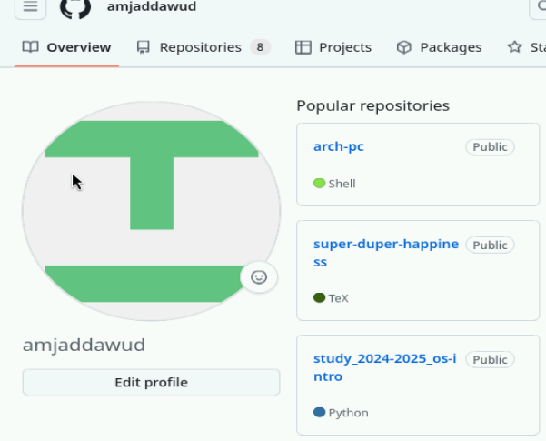{#fig:009 width=70%}

Вывожу список ключей:

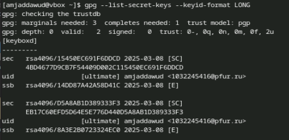{#fig:0010 width=70%}

Установливаю xclip: 

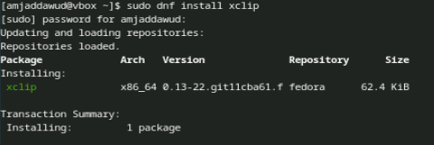{#fig:0011 width=70%}

Cкопирую сгенерированный gpg ключ в буфер обмена:

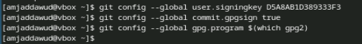{#fig:0012 width=70%}

Далее перехожу в настройки GitHub, нажимаю на кнопку New GPG key и вставляю полученный ключ:

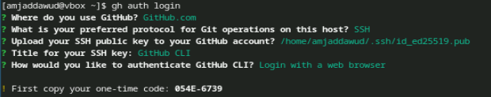{#fig:0013 width=70%}

Используя введёный email, указиваю Git применять его при подписи коммитов:

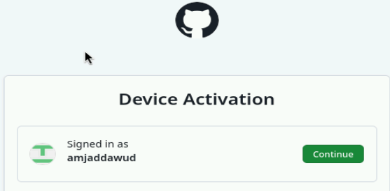{#fig:0014 width=70%}

Начинаю авторизацию в gh используя gh auth login:

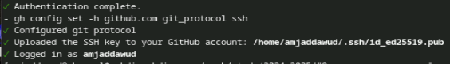{#fig:0015 width=70%}

Завершаю авторизацию на броузер:

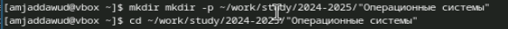{#fig:0016 width=70%}

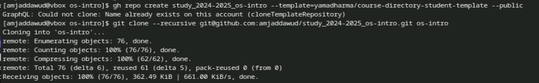{#fig:0017 width=70%}

## Создание локального каталога для выполнения заданий.

Создаю каталог "mkdir -p ~/work/study/2022-2023/"Операционные системы":

{#fig:0018 width=70%}

Перехожу в созданный каталог:

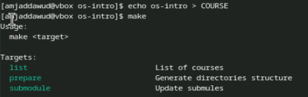{#fig:0019 width=70%}

Удаляю лишные файлы:

{#fig:0020 width=70%}

Создаю еще необходимые каталоги:

{#fig:0021 width=70%}

Отправляю Файлы на сервер:

{#fig:0022 width=70%}

# Выводы

При выполнении лабораторной работы я изучила идеалогию, применение средств контроля версий и освоеила умение по работе с git.

# Ответы на контрольные вопросы

1. Системы Контроля Версий - Программные инструменты, помагающие командам разработчиков управлять изменениями в исходном коде с течением времени.

2. Хранилище - в нем храняются все документы, включая историю их изменение и прочей служебной информацией.

   commit - отслеживание измененийб сохраняет разницу в изменениях.
   
   история - Хранит все изменения в проекте и позволяет при необходимости обратиться к нужным данным.
   
   рабочая копия- копия проекта основанная на версии из хранилища.
   
3. В ценрализованном VCS например AccuRev, каждый пользователь копирует себе необходимые ему файлы из репзитория, изменяет их а затем добавляет измениения обратно в хранилище. В децентрализованном VCS например Git, есть возможность добавлять и забирать изменения из любого репозитория.

4. Сначала создается и подключается удаленный репозиторий, затем по мере изменения проекта эти изменения отправляются на сервер.

5. Участник проекта перед началом работы получает нужную ему версию проекта в хранилище, с помощью определенных команд, после внесения изменений пользователь размещает новую версию в хранилище. При этом предыдущие версии не удаляются. К ним можно вернуться в любой момент.

6. Хранение информации о всех изменениях в вашем коде, обеспечение удобства командной работы над кодом.

Создание основного дерева репозитория: git init

7. Получение обновлений (изменений) текущего дерева из центрального репозитория: git pull

   Отправка всех произведённых изменений локального дерева в центральный репозиторий: git push

   Просмотр списка изменённых файлов в текущей директории: git status

   Просмотр текущих изменений: git diff

   Сохранение текущих изменений: добавить все изменённые и/или созданные файлы и/или каталоги: git add .

   добавить конкретные изменённые и/или созданные файлы и/или каталоги: git add имена_файлов

   удалить файл и/или каталог из индекса репозитория (при этом файл и/или каталог остаётся в локальной директории): git rm имена_файлов

   Сохранение добавленных изменений:

   сохранить все добавленные изменения и все изменённые файлы: git commit -am 'Описание коммита'

   сохранить добавленные изменения с внесением комментария через встроенный редактор: git commit

   создание новой ветки, базирующейся на текущей: git checkout -b имя_ветки

   переключение на некоторую ветку: git checkout имя_ветки (при переключении на ветку, которой ещё нет в локальном репозитории, она будет создана и связана с удалённой)

   отправка изменений конкретной ветки в центральный репозиторий: git push origin имя_ветки

   слияние ветки с текущим деревом: git merge --no-ff имя_ветки

   Удаление ветки:

   удаление локальной уже слитой с основным деревом ветки: git branch -d имя_ветки

   принудительное удаление локальной ветки: git branch -D имя_ветки

   удаление ветки с центрального репозитория: git push origin :имя_ветки

8. git push -all отправляем из локального репозитория все сохраненные изменения в центральный репозиторий, предварительно создав локальный репозиторий и сделав предварительную конфигурацию.

9. Ветвление - один из параллельных участков в одном хранилище, исходящих из одной версии, обычно есть главная ветка. Между ветками, т. е. их концами возможно их слияние. Используются для разработки новых функций.

10. Во время работы над проектом могут создаваться файлы, которые не следуют добавлять в репозиторий. Например, временные файлы. Можно прописать шаблоны игнорируемых при добавлении в репозиторий типов файлов в файл .gitignore с помощью сервисов.

# Список литературы

::: [Архитектура ЭВМ](https://esystem.rudn.ru/mod/page/view.php?id=1098790#org2c71102)
:::
