---
## Front matter
lang: ru-RU
title: Структура научной презентации
subtitle: Простейший шаблон
author:
  - Дауд А.
institute:
  - Российский университет дружбы народов, Москва, Россия
  - Объединённый институт ядерных исследований, Дубна, Россия
date: 10 апреля 2025

## i18n babel
babel-lang: russian
babel-otherlangs: english

## Formatting pdf
toc: false
toc-title: Содержание
slide_level: 2
aspectratio: 169
section-titles: true
theme: metropolis
header-includes:
 - \metroset{progressbar=frametitle,sectionpage=progressbar,numbering=fraction}
---

# Информация

## Докладчик

  
  * Дауд Амжад
  * НКА 04-24
  * Факультет физико-математический и естественных наук
  * Российский университет дружбы народов
  * [1032245416@rudn.ru](1032245416@rudn.ru)
  * <https://amjaddawud.github.io/>

# Цель работы

- Освоение основных возможностей командной оболочки Midnight Commander. Приобретение навыков практической работы по просмотру каталогов и файлов; манипуляций с ними.

# Задание

- Задание по mc
- Задание по встроенному редактору mc

# Выполнение лабораторной работы
## Задание по mc

- Изучаю информацию о mc, вызвав в командной строке man mc (рис. 1).

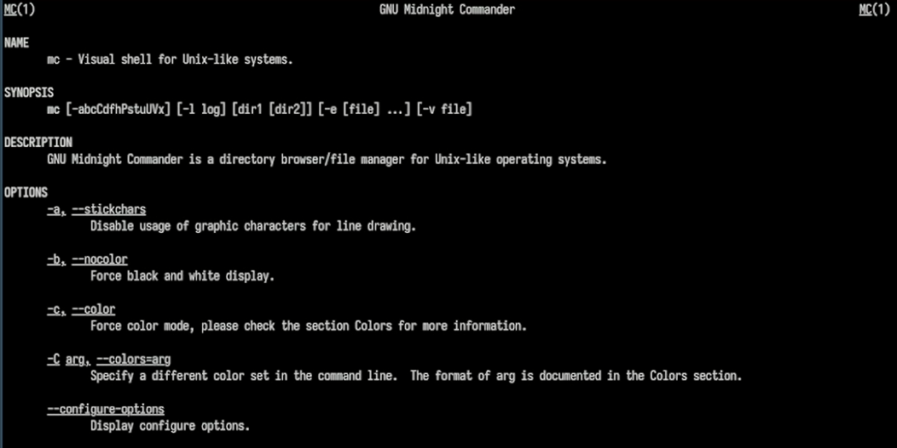{width=70%}

## Задание по mc

- Запускаю из командной строки mc, изучаю его структуру и меню (рис. 2).

{width=70%}

## Задание по mc

- Выполняю несколько операций в mc, используя управляющие клавиши (операции с панелями; выделение/отмена выделения файлов, копирование/перемещение файлов, получение информации о размере и правах доступа на файлы и/или каталоги и т.п.) (рис. 3) (рис. 4) (рис. 5) (рис. 6).

{width=70%}

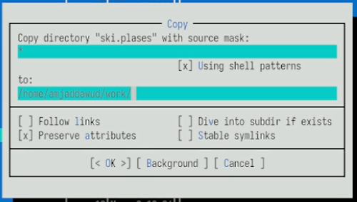{width=70%}

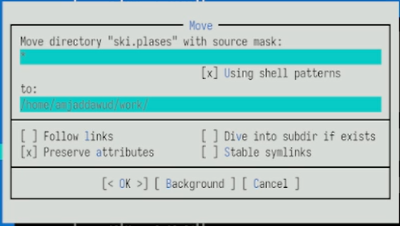{width=70%}

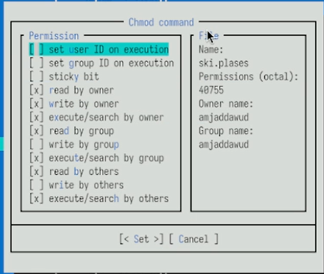{width=70%}

## Задание по mc

- Выполняю основные команды меню левой панели. Просматриваю информацию, дерево каталогов (рис. 7) (рис. 8).

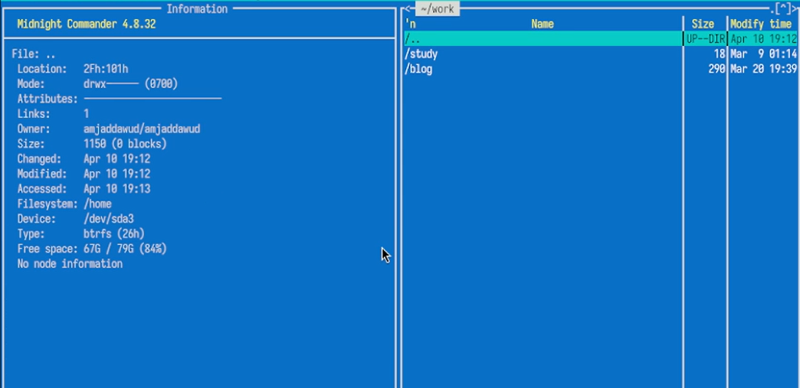{width=70%}

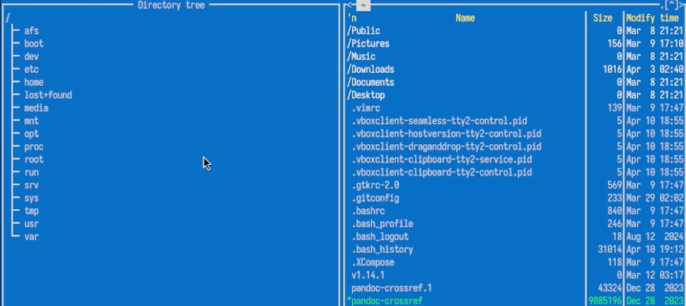{width=70%}

## Задание по mc

- Используя возможности подменю Файл, просматриваю содержимое текстового файла, редактирую содержимое текстового файла (без сохранения результатов редактирования), создаю каталог new, копирую файлы в созданный каталог (рис. 9) (рис. 10) (рис. 11) (рис. 12).

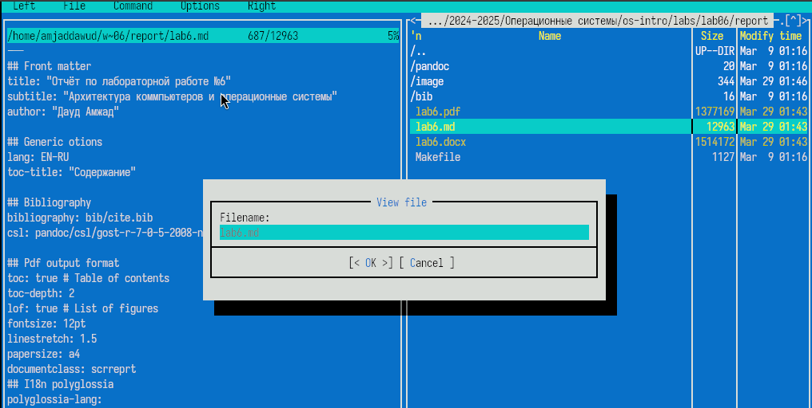{width=70%}

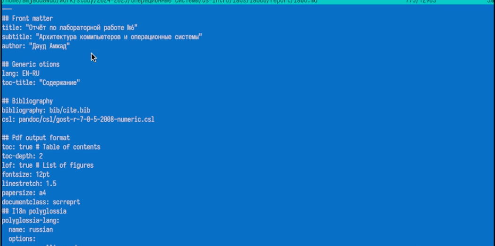{width=70%}

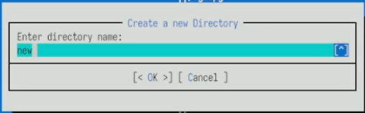{width=70%}

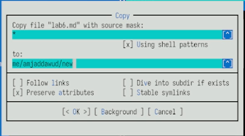{width=70%}

## Задание по mc

- С помощью соответствующих средств подменю Команда осуществляю: поиск в файловой системе файла с расширением .c, содержащего строку main), выбор и повторение одной из предыдущих команд, переход в домашний каталог, анализ файла меню и файла расширений. (рис. 13) (рис. 14) (рис. 15).
 
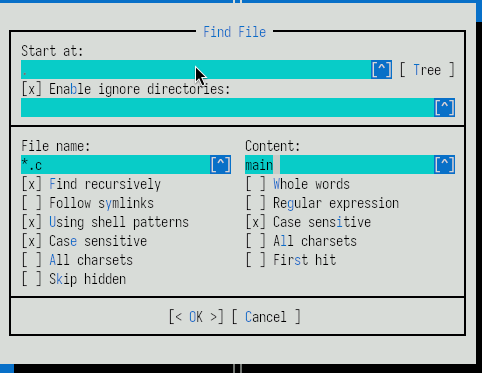{width=70%}

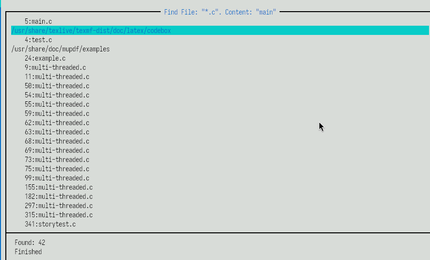{width=70%}

{width=70%}

## Задание по mc

- Вызываю подменю Настройки. Осваиваю операции, определяющие структуру экрана mc (Full screen, Double Width, Show Hidden Files и т.д.) (рис. 16) (рис. 17) (рис. 18).

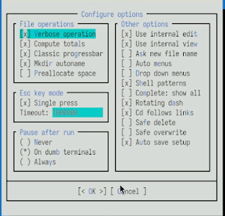{width=70%}

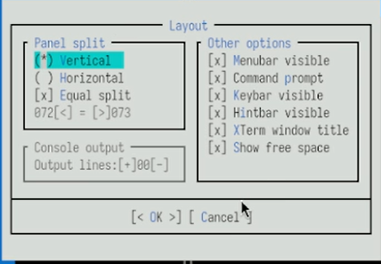{width=70%}

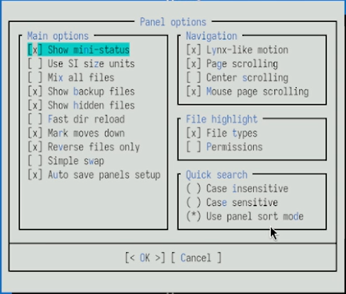{width=70%}

## Задание по встроенному редактору mc

- Создаю текстовый файл text.txt (рис. 19).

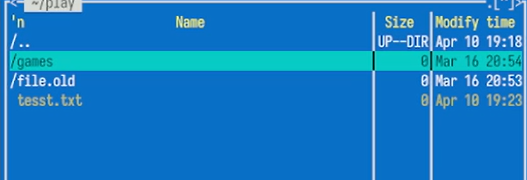{width=70%}

## Задание по встроенному редактору mc

- Открываю этот файл с помощью встроенного в mc редактора (рис. 20).

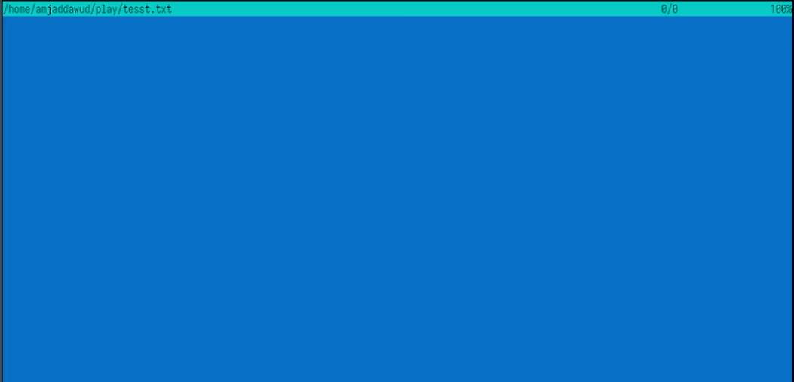{width=70%}

## Задание по встроенному редактору mc

- Вставляю в открытый файл небольшой фрагмент текста, скопированный из другого файла. (рис. 21).

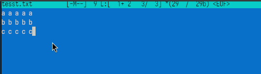{width=70%}

## Задание по встроенному редактору mc

- Проделываю с текстом следующие манипуляции, используя горячие клавиши: удаляю строку текста, выделяю фрагмент текста и копирую его на новую строку, выделяю фрагмент текста и переношу его на новую строку, сохраняю файл, отменяю последнее действие, перехожу в конец файла (нажав комбинацию клавиш) и пишу некоторый
текст, перехожу в начало файла (нажав комбинацию клавиш) и пишу некоторый текст, сохраняю и закрываю файл. (рис. 22) (рис. 23) (рис. 24) (рис. 25) (рис. 26) (рис. 27) (рис. 28) (рис. 29).

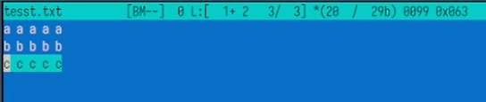{width=70%}

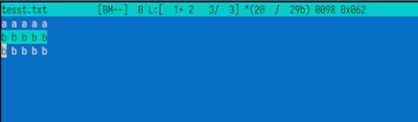{width=70%}

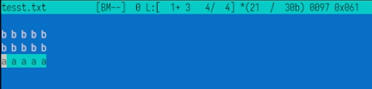{width=70%}

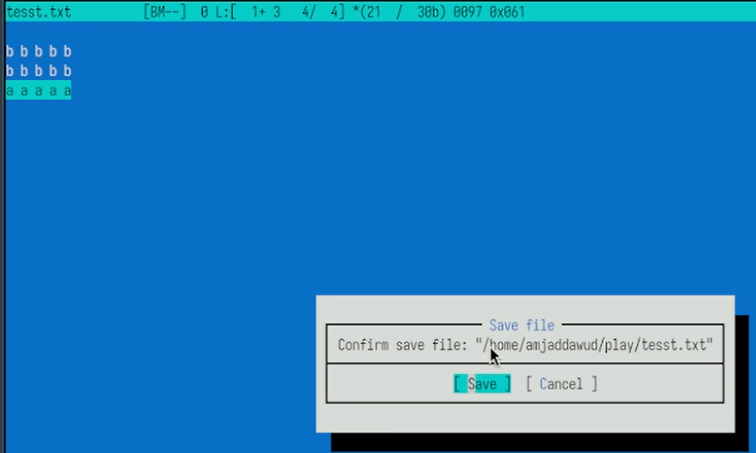{width=70%}

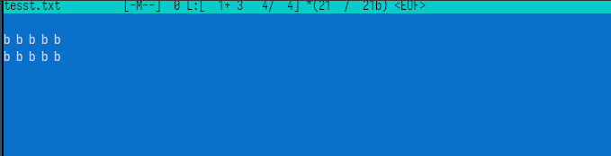{width=70%}

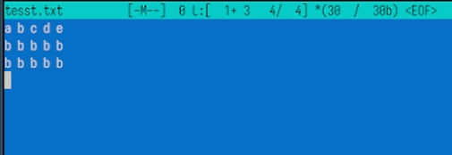{width=70%}

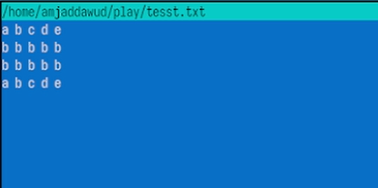{width=70%}

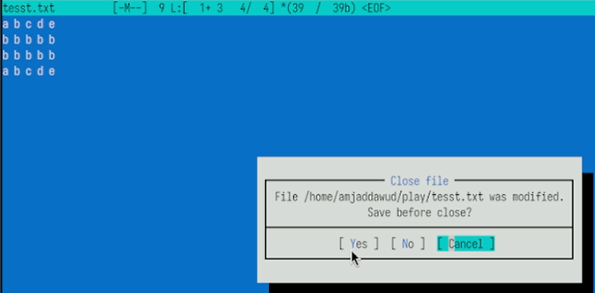{width=70%}

## Задание по встроенному редактору mc

- Открываю файл с исходным текстом на языке программирования C (рис. 30).

{width=70%}

## Задание по встроенному редактору mc

- Используя меню редактора, включаю подсветку синтаксиса, так как она не была включена (рис. 31) (рис. 32).

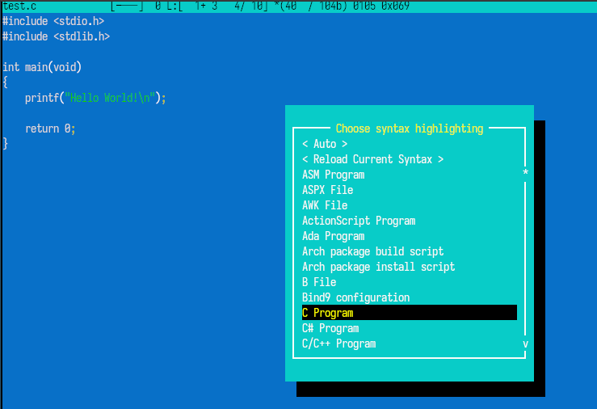{width=70%}

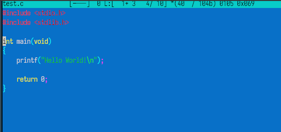{width=70%}

# Выводы

- Я освоила основные возможности командной оболочки Midnight Commander. Приобрела навыки практической работы по просмотру каталогов и файлов; манипуляций с ними.

# Спасибо за внимание