---
## Front matter
title: "Шаблон отчёта по лабораторной работе"
subtitle: "Простейший вариант"
author: "Дауд Амжад"

## Generic otions
lang: ru-RU
toc-title: "Содержание"

## Bibliography
bibliography: bib/cite.bib
csl: pandoc/csl/gost-r-7-0-5-2008-numeric.csl

## Pdf output format
toc: true # Table of contents
toc-depth: 2
lof: true # List of figures
lot: true # List of tables
fontsize: 12pt
linestretch: 1.5
papersize: a4
documentclass: scrreprt
## I18n polyglossia
polyglossia-lang:
  name: russian
  options:
	- spelling=modern
	- babelshorthands=true
polyglossia-otherlangs:
  name: english
## I18n babel
babel-lang: russian
babel-otherlangs: english
## Fonts
mainfont: IBM Plex Serif
romanfont: IBM Plex Serif
sansfont: IBM Plex Sans
monofont: IBM Plex Mono
mathfont: STIX Two Math
mainfontoptions: Ligatures=Common,Ligatures=TeX,Scale=0.94
romanfontoptions: Ligatures=Common,Ligatures=TeX,Scale=0.94
sansfontoptions: Ligatures=Common,Ligatures=TeX,Scale=MatchLowercase,Scale=0.94
monofontoptions: Scale=MatchLowercase,Scale=0.94,FakeStretch=0.9
mathfontoptions:
## Biblatex
biblatex: true
biblio-style: "gost-numeric"
biblatexoptions:
  - parentracker=true
  - backend=biber
  - hyperref=auto
  - language=auto
  - autolang=other*
  - citestyle=gost-numeric
## Pandoc-crossref LaTeX customization
figureTitle: "Рис."
tableTitle: "Таблица"
listingTitle: "Листинг"
lofTitle: "Список иллюстраций"
lotTitle: "Список таблиц"
lolTitle: "Листинги"
## Misc options
indent: true
header-includes:
  - \usepackage{indentfirst}
  - \usepackage{float} # keep figures where there are in the text
  - \floatplacement{figure}{H} # keep figures where there are in the text
---

# Цель работы

Освоение основных возможностей командной оболочки Midnight Commander. Приобретение навыков практической работы по просмотру каталогов и файлов; манипуляций с ними.

# Задание

1. Задание по mc
1.1 Изучите информацию о mc, вызвав в командной строке man mc.
1.2 Запустите из командной строки mc, изучите его структуру и меню.
1.3 Выполните несколько операций в mc, используя управляющие клавиши (операции
с панелями; выделение/отмена выделения файлов, копирование/перемещение фай-
лов, получение информации о размере и правах доступа на файлы и/или каталоги
и т.п.)
1.4 Выполните основные команды меню левой (или правой) панели. Оцените степень
подробности вывода информации о файлах.
1.5 Используя возможности подменю Файл , выполните:
– просмотр содержимого текстового файла;
– редактирование содержимого текстового файла (без сохранения результатов
редактирования);
– создание каталога;
– копирование в файлов в созданный каталог.
1.6 С помощью соответствующих средств подменю Команда осуществите:
– поиск в файловой системе файла с заданными условиями (например, файла
с расширением .c или .cpp, содержащего строку main);
– выбор и повторение одной из предыдущих команд;
– переход в домашний каталог;
– анализ файла меню и файла расширений.
1.7 Вызовите подменю Настройки . Освойте операции, определяющие структуру экрана mc
(Full screen, Double Width, Show Hidden Files и т.д.)

2. Задание по встроенному редактору mc
2.1 Создайте текстовой файл text.txt.
2.2 Откройте этот файл с помощью встроенного в mc редактора.
2.3 Вставьте в открытый файл небольшой фрагмент текста, скопированный из любого
другого файла или Интернета.
2.4 Проделайте с текстом следующие манипуляции, используя горячие клавиши:
2.4.1 Удалите строку текста.
2.4.2 Выделите фрагмент текста и скопируйте его на новую строку.
2.4.3 Выделите фрагмент текста и перенесите его на новую строку.
2.4.4 Сохраните файл.
2.4.5 Отмените последнее действие.
2.4.6 Перейдите в конец файла (нажав комбинацию клавиш) и напишите некоторый
текст.
2.4.7 Перейдите в начало файла (нажав комбинацию клавиш) и напишите некоторый
текст.
2.4.8 Сохраните и закройте файл.
2.5 Откройте файл с исходным текстом на некотором языке программирования (напри-
мер C или Java)
2.6 Используя меню редактора, включите подсветку синтаксиса, если она не включена,
или выключите, если она включена.

3. Контрольные вопросы

# Теоретическое введение

Здесь описываются теоретические аспекты, связанные с выполнением работы.

Например, в табл. [-@tbl:std-dir] приведено краткое описание стандартных каталогов Unix.

: Описание некоторых каталогов файловой системы GNU Linux {#tbl:std-dir}

| Имя каталога | Описание каталога                                                                                                          |
|--------------|----------------------------------------------------------------------------------------------------------------------------|
| `/`          | Корневая директория, содержащая всю файловую                                                                               |
| `/bin `      | Основные системные утилиты, необходимые как в однопользовательском режиме, так и при обычной работе всем пользователям     |
| `/etc`       | Общесистемные конфигурационные файлы и файлы конфигурации установленных программ                                           |
| `/home`      | Содержит домашние директории пользователей, которые, в свою очередь, содержат персональные настройки и данные пользователя |
| `/media`     | Точки монтирования для сменных носителей                                                                                   |
| `/root`      | Домашняя директория пользователя  `root`                                                                                   |
| `/tmp`       | Временные файлы                                                                                                            |
| `/usr`       | Вторичная иерархия для данных пользователя                                                                                 |

Более подробно про Unix см. в [@tanenbaum_book_modern-os_ru; @robbins_book_bash_en; @zarrelli_book_mastering-bash_en; @newham_book_learning-bash_en].

# Выполнение лабораторной работы
## Задание по mc

Изучаю информацию о mc, вызвав в командной строке man mc (рис. [-@fig:001]).

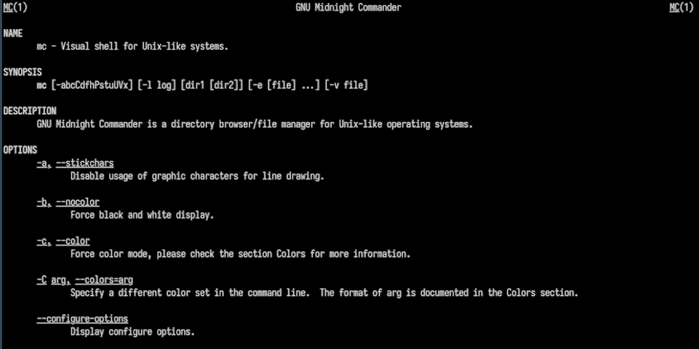{#fig:001 width=70%}

Запустите из командной строки mc, изучите его структуру и меню (рис. [-@fig:002]).

{#fig:002 width=70%}

Выполняю несколько операций в mc, используя управляющие клавиши (операции
с панелями; выделение/отмена выделения файлов, копирование/перемещение фай-
лов, получение информации о размере и правах доступа на файлы и/или каталоги
и т.п.) (рис. [-@fig:003]) (рис. [-@fig:004]) (рис. [-@fig:005]) (рис. [-@fig:006]).

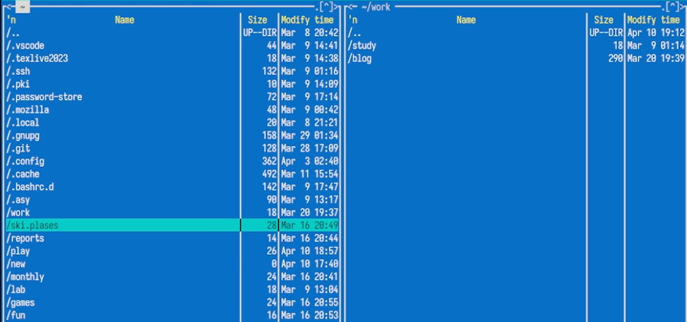{#fig:003 width=70%}

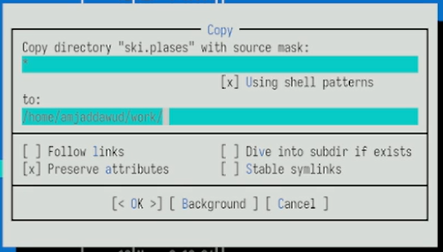{#fig:004 width=70%}

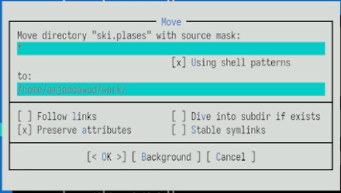{#fig:005 width=70%}

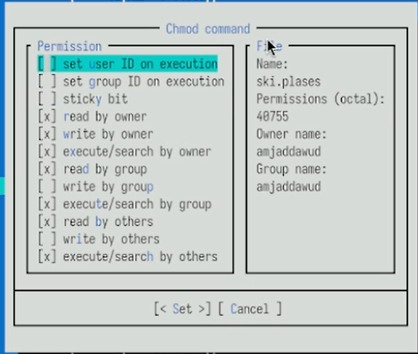{#fig:006 width=70%}

Выполняю основные команды меню левой панели. Просматриваю информацию, дерево каталогов (рис. [-@fig:007]) (рис. [-@fig:008]).

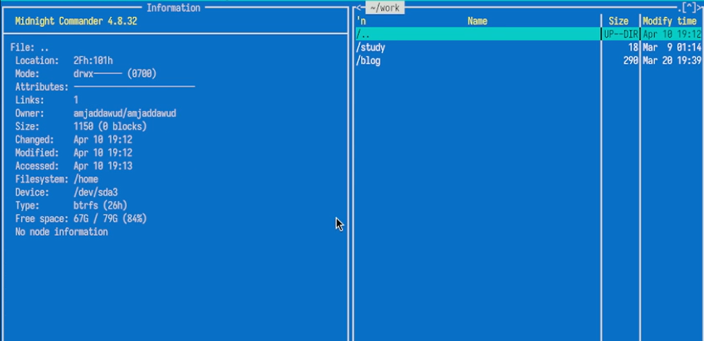{#fig:007 width=70%}

{#fig:008 width=70%}

Используя возможности подменю Файл, просмотриваю содержимое текстового файла, редактирую содержимое текстового файла (без сохранения результатов редактирования), создаю каталог new, копирую файлы в созданный каталог (рис. [-@fig:009]) (рис. [-@fig:010]) (рис. [-@fig:011]) (рис. [-@fig:012]).

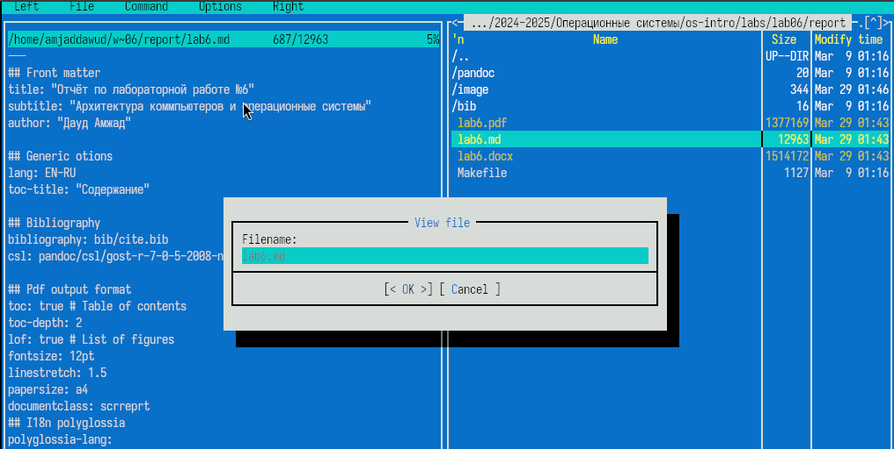{#fig:009 width=70%}

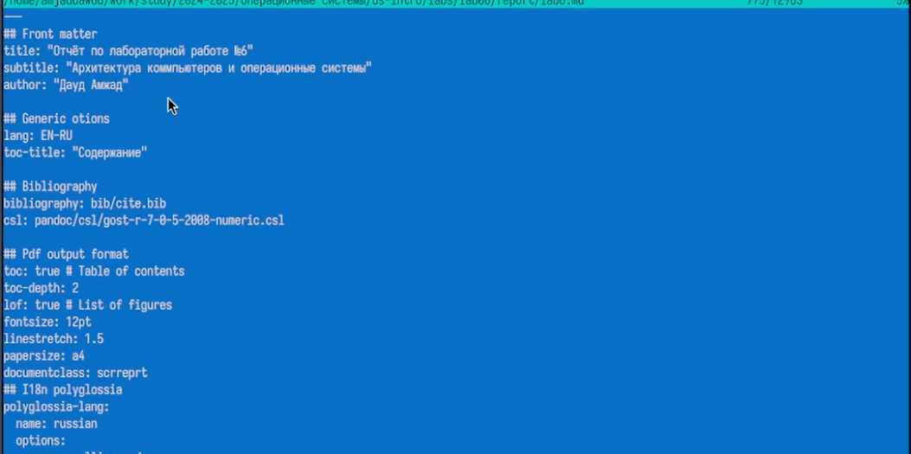{#fig:010 width=70%}

{#fig:011 width=70%}

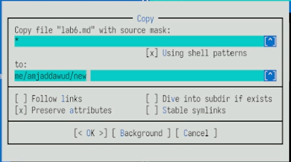{#fig:012 width=70%}

С помощью соответствующих средств подменю Команда осуществляю: поиск в файловой системе файла с расширением .c, содержащего строку main), выбор и повторение одной из предыдущих команд, переход в домашний каталог, анализ файла меню и файла расширений. (рис. [-@fig:013]) (рис. [-@fig:014]) (рис. [-@fig:015]).
 
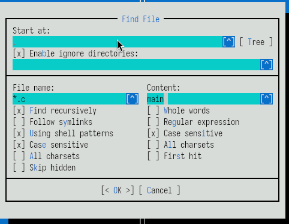{#fig:013 width=70%}

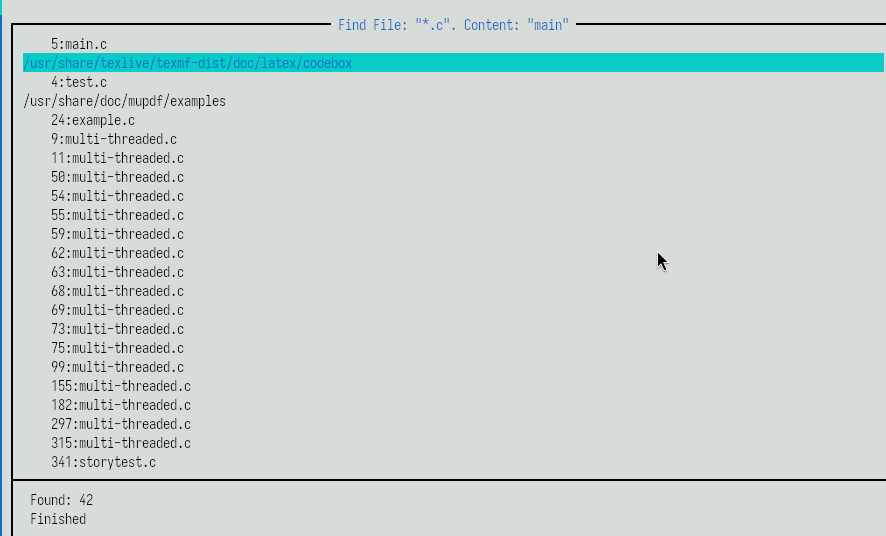{#fig:014 width=70%}

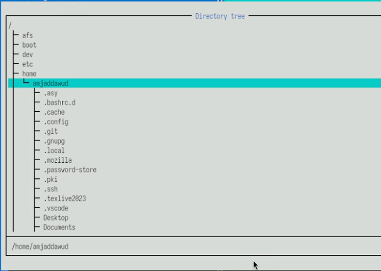{#fig:015 width=70%}

Вызываю подменю Настройки. Осваиваю операции, определяющие структуру экрана mc (Full screen, Double Width, Show Hidden Files и т.д.) (рис. [-@fig:016]) (рис. [-@fig:017]) (рис. [-@fig:018]).

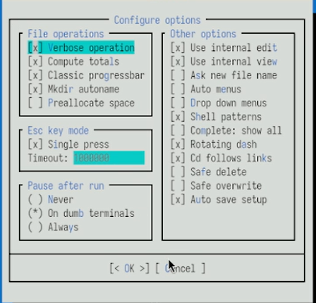{#fig:016 width=70%}

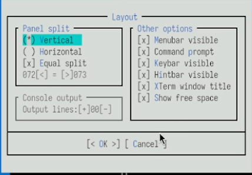{#fig:017 width=70%}

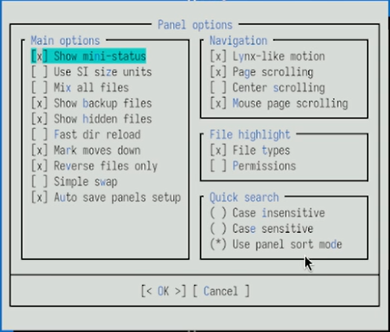{#fig:018 width=70%}

## Задание по встроенному редактору mc

Создаю текстовой файл text.txt (рис. [-@fig:019]).

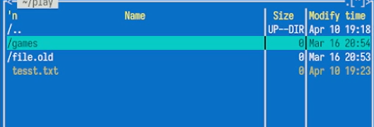{#fig:019 width=70%}

Открываю этот файл с помощью встроенного в mc редактора (рис. [-@fig:020]).

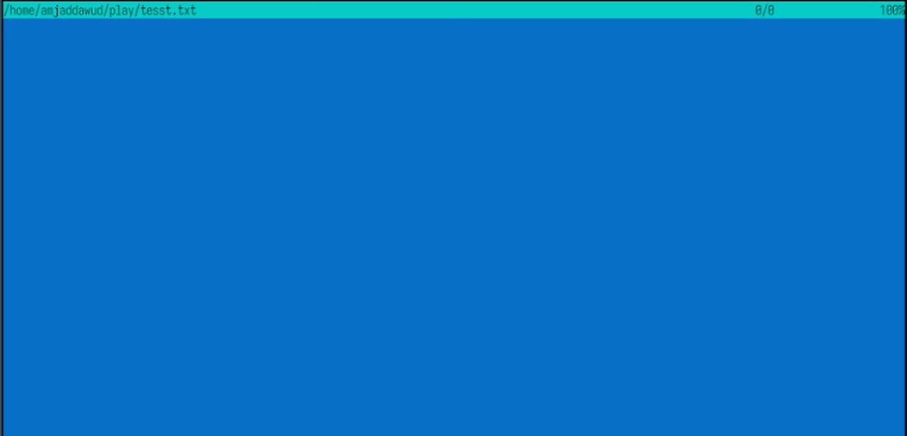{#fig:020 width=70%}

Вставляю в открытый файл небольшой фрагмент текста, скопированный из другого файла. (рис. [-@fig:021]).

{#fig:021 width=70%}

Проделываю с текстом следующие манипуляции, используя горячие клавиши: удаляю строку текста, выделяю фрагмент текста и копирую его на новую строку, выделяю фрагмент текста и переношу его на новую строку, сохраняю файл, отменяю последнее действие, перехожу в конец файла (нажав комбинацию клавиш) и пишу некоторый
текст, перехожу в начало файла (нажав комбинацию клавиш) и пишу некоторый текст, сохраняю и закрываю файл. (рис. [-@fig:022]) (рис. [-@fig:023]) (рис. [-@fig:024]) (рис. [-@fig:025]) (рис. [-@fig:026]) (рис. [-@fig:027]) (рис. [-@fig:028]) (рис. [-@fig:029]).

{#fig:022 width=70%}

{#fig:023 width=70%}

{#fig:024 width=70%}

{#fig:025 width=70%}

{#fig:026 width=70%}

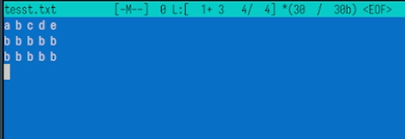{#fig:027 width=70%}

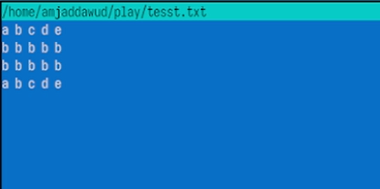{#fig:028 width=70%}

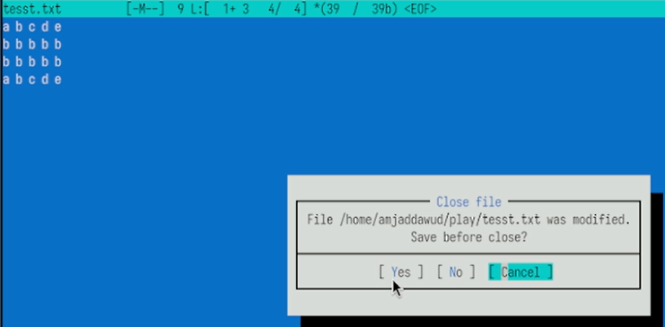{#fig:029 width=70%}

Открываю файл с исходным текстом на языке программирования C (рис. [-@fig:030]).

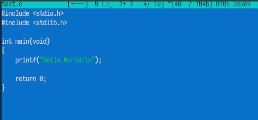{#fig:030 width=70%}

Используя меню редактора, включаю подсветку синтаксиса, так как она не была включена (рис. [-@fig:031]) (рис. [-@fig:032]) [@lab09].

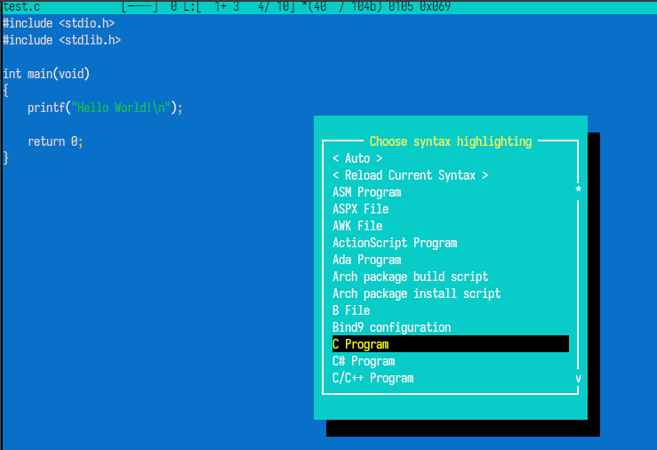{#fig:031 width=70%}

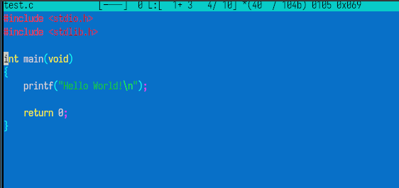{#fig:032 width=70%}

# Выводы

Я освоила основные возможности командной оболочки Midnight Commander. Приобрела навыки практической работы по просмотру каталогов и файлов; манипуляций с ними.

# Контрольные вопросы

1. Режимы работы в mc: терминальный режим (основной режим, в котором mc запускается в терминале), редактор (mc включает встроенный редактор, с помощью которого можно редактировать текстовые файлы).
2. Копирование файлов (пример: в shell - cp text.txt new_text.txt, в mc - выделить файл и нажать копировать), перемещение файлов (пример: в shell - mv text.txt new_text.txt, в mc - выделить файл и нажать переместить), удаление файлов (пример: в shell - rm text.txt, в mc - выделить файл и нажать удалить).
3. Левая и правая панели в mc отображают содержимое каталогов. Основные элементы: путь к директории, содержимое директории, информация о выделенном файле.
4. Меню Файл в mc содержит команды: открыть (открывает), копировать (копирует), переместить (перемещает), удалить (удаляет), создать каталог (создает каталог), выход (выходит).
5. Меню Команда в mc содержит: терминал (открывает новый терминал), командную строку (позволяет вводить команды shell), скрипты (запускает пользовательские скрипты).
6. Меню Настройки в mc содержит: настройки интерфейса (позволяет настроить внешний вид mc), настройки клавиш (позволяет настроить сочетания клавиш), настройки панели (настройка отображения информации в панелях).
7. Встроенные команды mc: cd (переход в другую директорию), ls (отображение содержимого текущей директории), mkdir (создание нового каталога), rm (удаление файла или каталога).
8. Встроенные команды редактора mc: сохранить (сохранить изменения), закрыть (закрыть редактор), поиск (найти текст в файле), замена (заменить текст).
9. С помощью редактирования файла ~/.config/mc/ini для добавления своих команд.
10. Можно настроить горячие клавиши для выполнения действий над текущим файлом.

# Список литературы{.unnumbered}

::: {#refs}
:::
