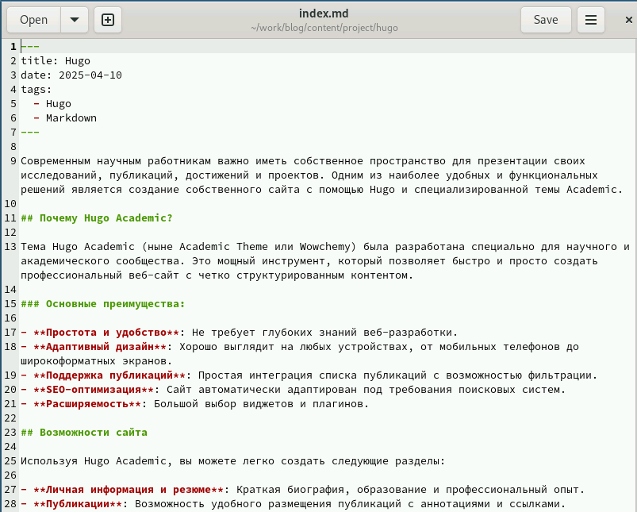
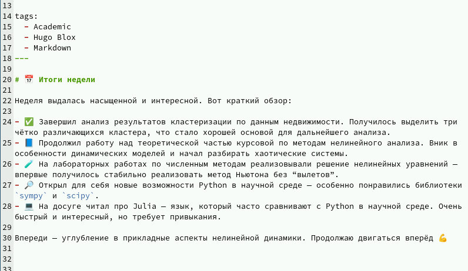
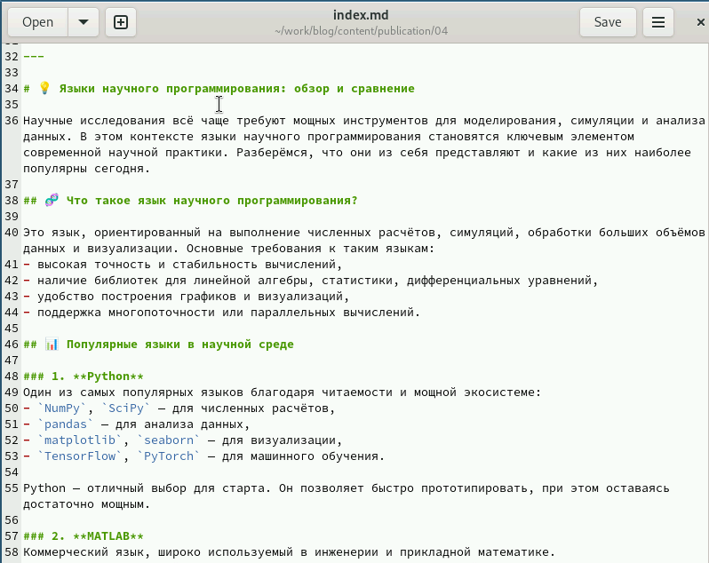

---
## Front matter
lang: ru-RU
title: Операционные системы
subtitle: Отчёт по 5 этапу проекта
author:
  - Дауд Амжад
institute:
  - Российский университет дружбы народов, Москва, Россия
date: 10 МАЯ 2025

## i18n babel
babel-lang: russian
babel-otherlangs: english

## Formatting pdf
toc: false
toc-title: Содержание
slide_level: 2
aspectratio: 169
section-titles: true
theme: metropolis
header-includes:
 - \metroset{progressbar=frametitle,sectionpage=progressbar,numbering=fraction}
---

# Информация

## Докладчик

:::::::::::::: {.columns align=center}
::: {.column width="70%"}

  * Дауд Амжад
  * НКА 04-24
  * Факультет физико математических и естесвенных наук
  * Российский университет дружбы народов
  * [1032245416@rudn.ru](mailto:1032245416@rudn.ru)
  * <https://amjaddawud.github.io/ru/>

:::
::::::::::::::

# Цели и задачи

## Цель лабораторной работы

Добавить к сайту данные о себе.

# Выполнение лабораторной работы

## Файл о проекте

{ #fig:001 width=70% height=70%}

## Файл для поста

{ #fig:002 width=70% height=70%}

## Файл для публикации

{ #fig:003 width=70% height=70%}

# Выводы

## Результаты выполнения лабораторной работы

Добавили к сайту данные о себе.